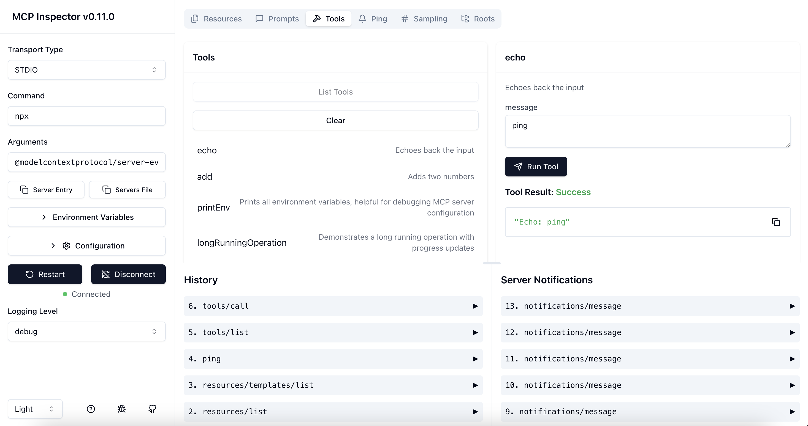

# copilot-and-mcp

This repository is used to test the capabilities of GitHub Copilot with the MCP (Model Context Protocol) server to enhance the capabilities.

## GitHub Copilot
- [Custom Instructions](https://docs.github.com/en/copilot/how-tos/configure-custom-instructions/add-repository-instructions?tool=vscode)
- [Extending GitHub Copilot with the MCP](https://docs.github.com/en/copilot/how-tos/provide-context/use-mcp/extend-copilot-chat-with-mcp)

## MCP Servers
The following MCP servers are used in this repository:
- [Filesystem](https://github.com/modelcontextprotocol/servers/tree/main/src/filesystem) - Secure file operations with configurable access controls  
NOTE: Although GitHub Copilot supports file operations by default, it cannot access files outside the workspace.
- [PostgreSQL](https://github.com/modelcontextprotocol/servers-archived/tree/main/src/postgres) - Read-only database access with schema inspection capabilities

## Debugging MCP Servers
Use [MCP Inspector](https://github.com/modelcontextprotocol/inspector) to debug MCP servers.

## References
[Model Context Protocols (Anthropic)](https://modelcontextprotocol.io/examples)